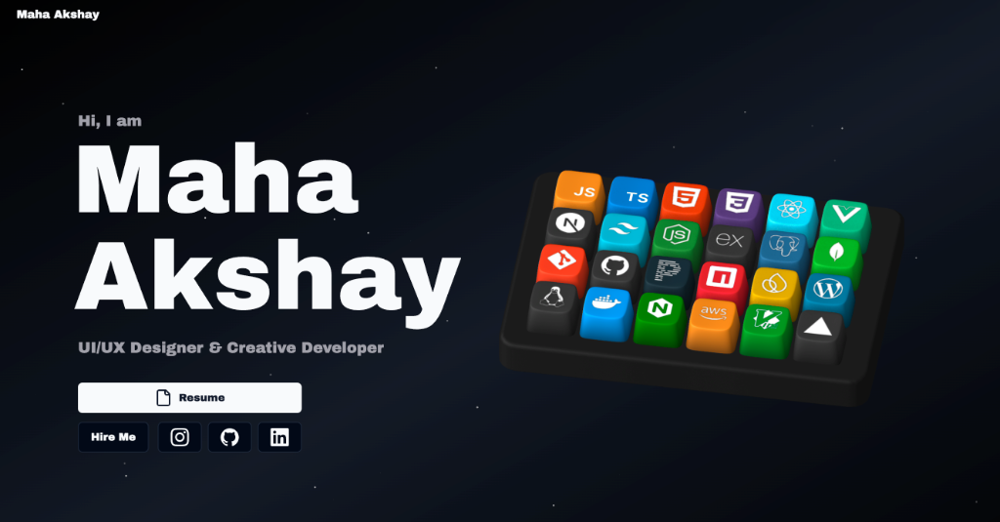

# 🌐 Maha Akshay — 3D Developer Portfolio

[](https://mahaakshay.vercel.app/)
[](https://github.com/mac20060630)

Personal 3D developer portfolio of **Maha Akshay** — UI/UX Designer & Creative Developer. Packed with interactive 3D animations, smooth transitions, and a space-themed aesthetic featuring a custom 3D keyboard skill showcase.



🔗 **Live Website:** [mahaakshay.vercel.app](https://mahaakshay.vercel.app/)

---

## ✨ Key Features

- **Interactive 3D Mechanical Keyboard** — Custom 3D Spline keyboard where keycaps represent skills with dynamic GSAP camera choreography and mechanical audio feedback.
- **Categorized Skills Matrix** — Comprehensive touch & trackpad-friendly tech stack matrix with real-time sound feedback.
- **Curated Projects Deck** — 6 production projects featuring SpeedRoute (Android + Gemini AI), The Eye (3D Geopolitical OSINT), client portfolios, and SaaS automation platforms with direct GitHub and Live demo links.
- **Academic & Industry Timeline** — Dual-track interactive timeline highlighting B.Tech at CMR University, Diploma at NMIT, and professional engineering internships.
- **Honors & Credentials** — Verified certifications and leadership milestones including OSA 2025 Core Team, Cisco Networking, and Infosys Springboard AI/ML.
- **Dynamic Animations** — Powered by GSAP and Framer Motion for smooth scroll, hover, and reveal effects.
- **Space Theme** — Cosmic aesthetic with floating canvas particles and dark/light mode parity.
- **Contact Form** — Direct email delivery integrated via Resend.

---

## 🛠️ Tech Stack

| Category | Technologies |
|---|---|
| **Framework** | Next.js 14, React 18, TypeScript |
| **Styling & UI** | Tailwind CSS, Shadcn UI, Aceternity UI |
| **Animations** | GSAP, Framer Motion |
| **3D Graphics** | Spline |
| **Email Service** | Resend |
| **Utilities** | Lenis (Smooth Scroll), Zod, Next-Themes |

---

## 💻 Local Development

### Prerequisites

- **Node.js**: v18 or higher
- **Package Manager**: pnpm, npm, or yarn

### Setup Instructions

1. **Clone the repository:**
   ```bash
   git clone https://github.com/mac20060630/3d-portfolio-main.git
   cd 3d-portfolio-main
   ```

2. **Install dependencies:**
   ```bash
   pnpm install
   ```

3. **Configure Environment Variables:**
   Create a `.env.local` file in the root directory:
   ```env
   RESEND_API_KEY=your_resend_api_key
   ```

4. **Start Development Server:**
   ```bash
   pnpm dev
   ```

5. Open [http://localhost:3000](http://localhost:3000) in your browser.

---

## 📬 Contact & Socials

- **Website:** [mahaakshay.vercel.app](https://mahaakshay.vercel.app/)
- **Email:** [maha30r@gmail.com](mailto:maha30r@gmail.com)
- **LinkedIn:** [Maha Akshay R](https://www.linkedin.com/in/maha-akshay-r-96690926a/)
- **Instagram:** [@mac.9035](https://www.instagram.com/mac.9035)
- **GitHub:** [@mac20060630](https://github.com/mac20060630)
